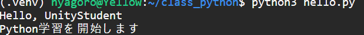

# 第16週 学習ドキュメント（学生向け）

## テーマ
Windows上のVirtualBoxでUbuntu仮想マシンを操作し、今後（第17週以降）も継続利用するPython開発環境を構築する。

## 到達目標
- VirtualBox上でUbuntu仮想マシンを起動・停止できる。
- Ubuntu上でPython実行環境（venvを含む）を構築できる。
- Pythonプログラムを作成・実行・修正できる。
- 次週以降に使い回せる作業ディレクトリ構成を整備できる。

## 事前準備（Windows側）
1. VirtualBoxがインストール済みであることを確認する。
2. Ubuntu仮想マシン（授業用）が作成済みであることを確認する。
3. ネットワーク接続を確認する（パッケージ更新で使用）。

## 実習
ターミナルやキーボード設定によって Ctrl + V が効かない場合があります。
- Shift + Insert を試す（Windowsの伝統的なペーストショートカット）
- Ctrl + Shift + V を試す

適宜、利用しているターミナルのヘルプを参照してください。

### 手順(1)：Ubuntu仮想マシンの起動
1. WindowsでVirtualBoxを起動する。
2. 授業用Ubuntu仮想マシンを選択し、**起動**する。
3. Ubuntuにログインする。

### 手順(2)：Ubuntuの初期更新
Ubuntuのターミナルを開き、以下を実行する。

```bash
sudo apt update
sudo apt upgrade -y
```

### 手順(3)：Python開発環境の構築
以下を順に実行する。

```bash
sudo apt install -y python3 python3-pip python3-venv
python3 --version
pip3 --version
```


表示されたバージョンを確認し、ノートに記録する。

- Python: インタプリタ型のプログラミング言語です。スクリプトを書いて即座に実行でき、標準ライブラリが豊富です。`python3 --version`でバージョン確認を行います。
- pip: Python 用のパッケージ管理ツールです。外部ライブラリ（例: requests, flask）をインストール・アンインストール・アップグレードします。使用例: `pip install requests`。仮想環境を有効化すると、その環境に対してpipが作用します。

### 手順(4)：授業用作業フォルダを作成
第17週以降も継続利用する前提で、専用フォルダを作る。

```bash
mkdir -p ~/class_python
cd ~/class_python
python3 -m venv .venv
source .venv/bin/activate
```
#### コマンドの解説
- `mkdir -p ~/class_python`: ホームディレクトリに`class_python`フォルダを作成する。`-p`は親ディレクトリがなければ作るオプション。
- `cd ~/class_python`: 作業場所を`class_python`フォルダに移動する。
- `python3 -m venv .venv`: 現在のフォルダ内に`.venv`という仮想環境を作成する。`-m venv`はPython標準機能を使う指定。
- `source .venv/bin/activate`: いま作った仮想環境を有効化する。有効化すると、その環境のPythonやpipを使うようになる。


#### venvとは
`venv`は、Pythonの標準機能で使える仮想環境作成ツールです。プロジェクトごとに独立したPython実行環境を作れるため、ライブラリのバージョン違いによる衝突を防げます。第17週以降も、毎回この仮想環境を有効化してから作業します。

補足:
- ライブラリとは: Pythonの機能を追加するための部品です。たとえば、`requests`はWeb通信、`flask`はWebサーバー作成、`pandas`は表データの操作に使います。自分で全部書かずに、必要な機能を追加できます。
- 衝突とは: 1つの環境に入れたライブラリのバージョンや依存関係が合わず、動かなくなるトラブルです。たとえば、Aの授業では`flask 2.x`が必要、Bの課題では`flask 3.x`が必要、というときに同じ環境だと片方が動かないことがあります。
- 環境を分けるメリット: 課題ごとに必要なライブラリやバージョンを分けられるため、他の作業に影響しません。以前の課題を壊さずに新しい課題を試せる、再現しやすい、トラブルの原因を切り分けやすい、という利点があります。
- 具体例: 第16週では`class_python/.venv`でPython基礎を学び、第17週以降は同じフォルダ内で`flask`や`sqlite3`関連の演習を行う。別の授業用フォルダを作れば、設定を変えずに別バージョンのライブラリも試せます。

公式ドキュメント:
- https://docs.python.org/3/library/venv.html


有効化後、プロンプト先頭に`(.venv)`が表示されることを確認する。

### 手順(5)：最初のPythonプログラム作成と実行
`hello.py`を作成し、以下を保存する。

```python
name = "UnityStudent"
print("Hello,", name)
print("Python学習を開始します")
```

コマンドを実行:

```bash
python3 hello.py
```
実行結果が表示されることを確認する。

### 手順(6)：仮想環境の終了と再開
終了:
仮想環境を終了するには以下のコマンドを実行する。
```bash
deactivate
```

次回再開するときは、作業フォルダに移動してから仮想環境を有効化する。

```bash
cd ~/class_python
source .venv/bin/activate
```

---

## 演習課題（プログラミング）

### 課題1：自己紹介プログラム
`profile.py`を作成し、以下の情報を変数で管理して表示する。
- 名前
- 学籍番号（仮でも可）
- 好きなゲームジャンル

条件:
- `print()`を3回以上使う。
- 文字列連結またはカンマ区切り出力のどちらかを使う。

### 課題2：簡易スコア計算プログラム
`score_calc.py`を作成し、次を実装する。
- `base_score = 1200`
- `bonus = 350`
- `penalty = 100`
- 最終スコア `final_score` を計算して表示する。

発展:
- 最終スコアが1000以上なら`"Rank: A"`、それ以外は`"Rank: B"`を表示する（if文）。

### 課題3：リスト演習（次週準備）
`numbers = [10, 20, 30, 40, 50]`を使い、以下を実装する。
- 合計値を表示
- 最大値を表示
- 要素数を表示

---

## 提出物
- `hello.py`
- `profile.py`
- `score_calc.py`
- 実行結果のスクリーンショット1枚以上

## チェックリスト
- [ ] Ubuntu仮想マシンを自力で起動できた
- [ ] Python / pip / venv を導入できた
- [ ] `~/class_python` と `.venv` を作成できた
- [ ] Pythonファイルを作成して実行できた
- [ ] 次回以降の再開手順を確認した

## 次週への接続
この環境は第17週以降のAPI実装・データ処理演習でも継続利用する。毎回、作業開始時に仮想環境を有効化してから開発すること。